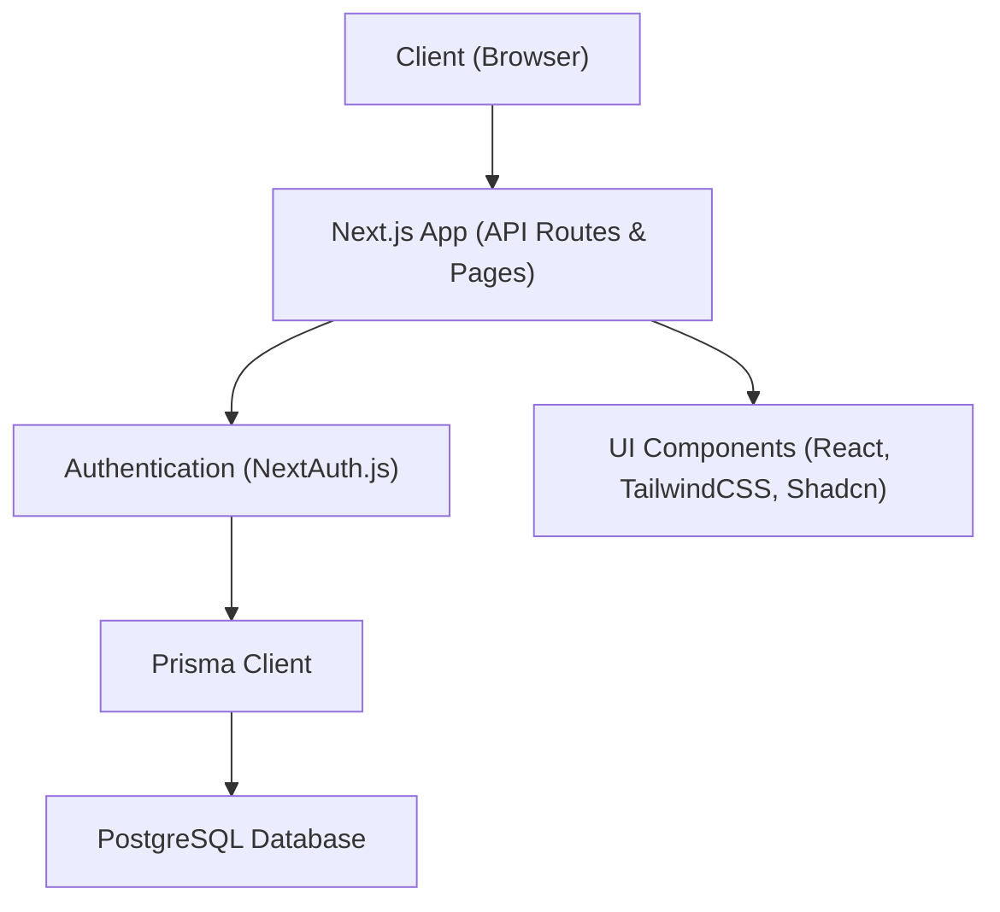

# Macro Tracker Next.js App

A modern, full-stack macro-tracking application built with Next.js, React, TypeScript, Prisma ORM, PostgreSQL, NextAuth.js, and styled with TailwindCSS and Shadcn UI components.

## 🚀 Live Demo

Try the app instantly, no setup required:  
👉 [MacroTrack](https://macrotrack.vercel.app)

##  Features

- User authentication (NextAuth.js)
- Profile management with photo upload
- Set and track daily macro goals (protein, carbs, fat, calories)
- Log food entries with nutritional breakdown
- Dashboard with progress visualization
- Responsive, accessible UI

## CI/CD & Deployment

- Automated with **GitHub Actions** (CI/CD).
- Auto-deployed to [Vercel](https://vercel.com/).
- **No need to set up CI/CD or Vercel to run locally.**


---

## Architecture

All access to user-specific data (macros, food entries, etc.) is protected by authentication. The app checks authentication using NextAuth.js before allowing any Prisma/database queries. Only authenticated users can access or modify their data.



- **Next.js App**: Handles all API requests and page rendering.
- **Authentication (NextAuth.js)**: Ensures only authenticated users can access protected data.
- **Prisma Client**: Used by the app to query and mutate data in the database, only after authentication.
- **PostgreSQL Database**: Stores all persistent data (users, macros, food entries, etc.).
- **UI Components**: Rendered by the app for the client.

---

## Prerequisites

Before you begin, ensure you have the following installed:

- **Git** (for cloning the repository): [Download Git](https://git-scm.com/downloads)
- **Node.js** (v18 or higher recommended): [Download Node.js](https://nodejs.org/)
- **npm** (comes with Node.js) or [Yarn](https://yarnpkg.com/) (optional)
- **PostgreSQL** (v13 or higher recommended): [Download PostgreSQL](https://www.postgresql.org/download/)

---

## Getting Started

> **Note:**  
> You can try the [live demo](https://macrotrack.vercel.app) without any setup.  
> The instructions below are for running the app locally.

### 1. Clone the repository
```bash
git clone <https://github.com/RudolfKay/Macro-Tracker-NextJS-App.git>
cd Macro-Tracker-NextJS-App
```

### 2. Install dependencies
```bash
npm install
```

### 3. Set up environment variables
- Copy the example env file:
  ```bash
  cp .env.example .env
  ```
- Fill in the required values in `.env`:
  - `DATABASE_URL` (your PostgreSQL connection string)
  - `NEXTAUTH_URL` (e.g., http://localhost:3000 for local dev)
  - `NEXTAUTH_SECRET` (generate with `node -e "console.log(require('crypto').randomBytes(32).toString('hex'))"`)

### 4. Set up the database (migrate & seed)
- Run the following command to set up your database and seed the default admin user:
  ```bash
  npm run setup:db
  ```
  This will:
  - Run all pending Prisma migrations
  - Seed the database with a default admin user (if not already present)

  **Default admin credentials:**
  - Email: `admin@macrotrack.com`
  - Password: `admin123`

  > **Note:**
  > The seeding is handled using Prisma's native TypeScript support via [tsx](https://github.com/esbuild-kit/tsx). You can also run the seed directly with:
  > ```bash
  > npx prisma db seed
  > ```
  > This is the same command used in CI/CD pipelines.

  **Warning:**
  > The seed script is intended for local development and onboarding. In production, you should run migrations and seeds manually and with care.  
  > **Do NOT run seeds automatically on every migration in production,** as this can lead to accidental data overwrites or security issues.

### 5. Start the development server
```bash
npm run dev
```

Open [http://localhost:3000](http://localhost:3000) in your browser.

---

## Usage
- Register a new account or log in.
- Set your daily macro goals.
- Add food entries throughout the day.
- View your progress and adjust goals as needed.
- Manage your profile and photo.

---

## Scripts
- `npm run dev` — Start the development server
- `npm run build` — Build for production
- `npm run start` — Start the production server
- `npm run setup:db` — Run all migrations and seed the default admin user (recommended for local/dev setup)
- `npx prisma migrate dev` — Run migrations and create the database (dev, advanced)
- `npx prisma generate` — Generate Prisma client

---

## Contributing
1. Fork the repo
2. Create a feature branch
3. Commit your changes
4. Open a pull request

---

## License
MIT

---

## Database Seeding

This project uses [Prisma's native TypeScript seeding](https://www.prisma.io/docs/guides/database/seed-database) for database initialization, powered by [tsx](https://github.com/esbuild-kit/tsx).

- To seed the database manually, run:
  ```bash
  npx prisma db seed
  ```
- This command is also used in automated CI/CD workflows.

The seed script will create a default admin user if one does not already exist.

> **Warning:**  
> The seed script is for local development and onboarding only.  
> In production, always review and run seeds manually to avoid accidental data loss or security issues.

