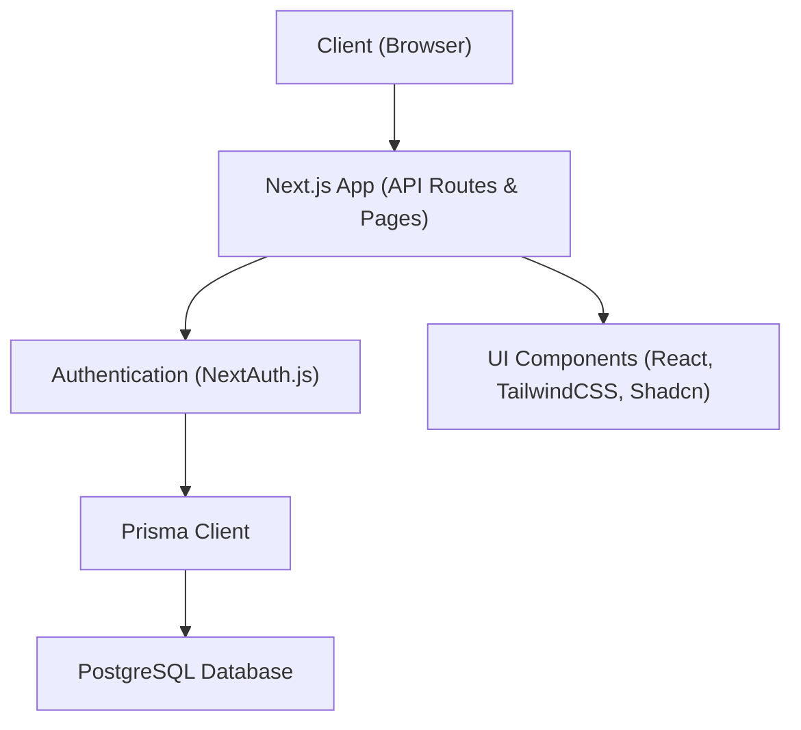

# Macro Tracker Next.js App

A modern, full-stack macro-tracking application built with Next.js, React, TypeScript, Prisma ORM, PostgreSQL, NextAuth.js, and styled with TailwindCSS and Shadcn UI components.

## Features
- User authentication (NextAuth.js)
- Profile management with photo upload
- Set and track daily macro goals (protein, carbs, fat, calories)
- Log food entries with nutritional breakdown
- Dashboard with progress visualization
- Responsive, accessible UI

---

## Architecture

All access to user-specific data (macros, food entries, etc.) is protected by authentication. The app checks authentication using NextAuth.js before allowing any Prisma/database queries. Only authenticated users can access or modify their data.



- **Next.js App**: Handles all API requests and page rendering.
- **Authentication (NextAuth.js)**: Ensures only authenticated users can access protected data.
- **Prisma Client**: Used by the app to query and mutate data in the database, only after authentication.
- **PostgreSQL Database**: Stores all persistent data (users, macros, food entries, etc.).
- **UI Components**: Rendered by the app for the client.

---

## Prerequisites

Before you begin, ensure you have the following installed:

- **Node.js** (v18 or higher recommended): [Download Node.js](https://nodejs.org/)
- **npm** (comes with Node.js) or [Yarn](https://yarnpkg.com/) (optional)
- **PostgreSQL** (v13 or higher recommended): [Download PostgreSQL](https://www.postgresql.org/download/)

---

## Getting Started

### 1. Clone the repository
```bash
git clone <https://github.com/RudolfKay/Macro-Tracker-NextJS-App.git>
cd Macro-Tracker-NextJS-App
```

### 2. Install dependencies
```bash
npm install
```

### 3. Set up environment variables
- Copy the example env file:
  ```bash
  cp .env.example .env
  ```
- Fill in the required values in `.env`:
  - `DATABASE_URL` (your PostgreSQL connection string)
  - `NEXTAUTH_URL` (e.g., http://localhost:3000 for local dev)
  - `NEXTAUTH_SECRET` (generate with `node -e "console.log(require('crypto').randomBytes(32).toString('hex'))"`)

### 4. Set up the database
- Ensure PostgreSQL is running and accessible.
- Run migrations and generate the Prisma client:
  ```bash
  npx prisma migrate dev
  # or for production
  # npx prisma migrate deploy
  ```

### 5. Start the development server
```bash
npm run dev
```

Open [http://localhost:3000](http://localhost:3000) in your browser.

---

## Usage
- Register a new account or log in.
- Set your daily macro goals.
- Add food entries throughout the day.
- View your progress and adjust goals as needed.
- Manage your profile and photo.

---

## Scripts
- `npm run dev` — Start the development server
- `npm run build` — Build for production
- `npm run start` — Start the production server
- `npx prisma migrate dev` — Run migrations and create the database (dev)
- `npx prisma generate` — Generate Prisma client

---

## Contributing
1. Fork the repo
2. Create a feature branch
3. Commit your changes
4. Open a pull request

---

## License
MIT
